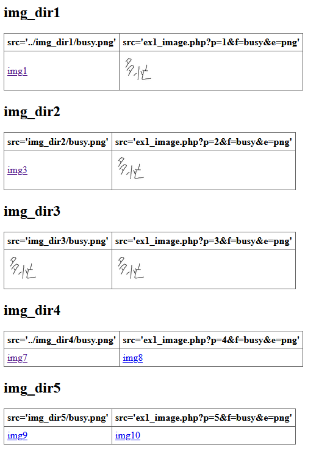

invisible_image_url
===

You can hide image URLs and add your auth system to images simply.

## Description

This system is working single php script file.

This script maybe can apply these cases.

- Hide image URLs
- Display images not including in the document root folder
- Add auth to images

## Demo



See `example` folder.

## Usage

```HTML
<!-- HTML -->

```

- `p=*` Number for setting multiple paths.
- `f=*` File name.
- `e=*` File extension.

## Warning

Be careful when (1) using HTML `` elements based on this script and (2) using cookie for session managements. Because `` normally allows cross domain accesses.

This means sending cookies to hosts specified by `src` attribute. Therefore, on other sites that you don't allow access to image maybe also can show images. (If site access users have auth accessing your site images.)

If you are interested, please search about "same-origin policy" and "CORS" and so on.

## License

[MIT license](https://opensource.org/licenses/MIT)

## Author

[haruhiko-zht](https://github.com/haruhiko-zht)
