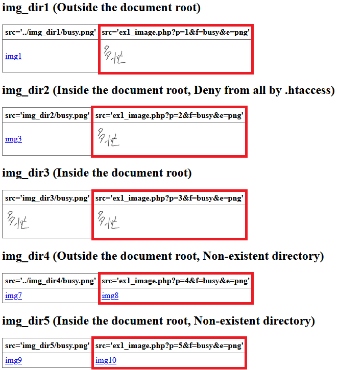

invisible_image_url
===

You can hide image URLs and add your auth system to images simply.

## Description

This system is working single php script file.

This script maybe can apply these cases.

- Hide image URLs
- Display images not including in the document root folder
- Add auth to images

The most important code is here.

```php
header('Content-Disposition: inline; filename= `filename`', true);
header('Content-type: `mime-type`', true);
readfile(`filepath`);
exit();
```

## Demo

Example system directory  


Example  


See `example` folder.

## Usage

```HTML
<!-- HTML -->

```

- `p=*` Number for setting multiple paths.
- `f=*` File name.
- `e=*` File extension.

## License

[MIT license](https://opensource.org/licenses/MIT)

## Author

- [haruhiko-zht](https://github.com/haruhiko-zht)
